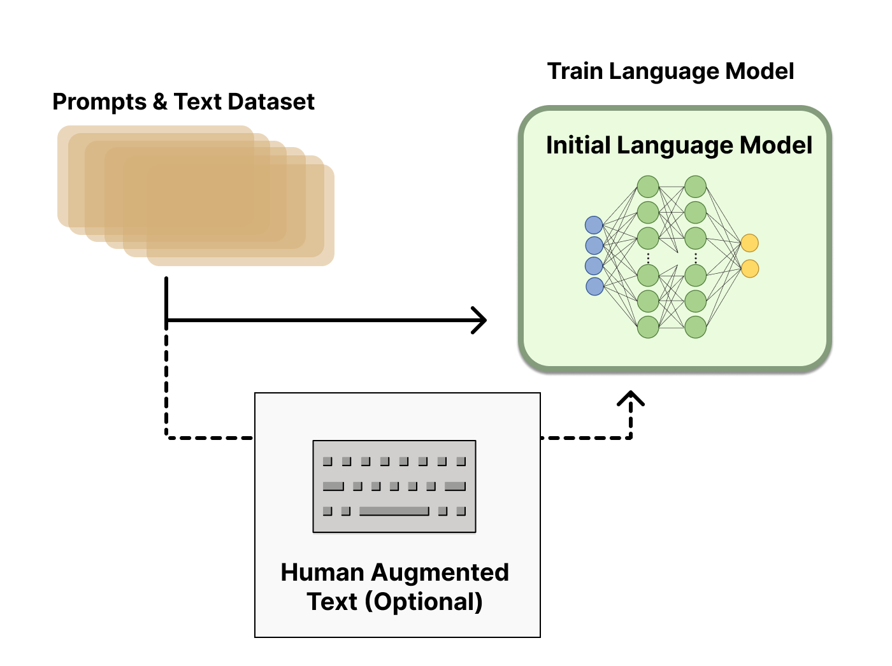

# Reinforcement Learning from Human Feedback (RLHF)

In this exercise, we will finetune a model pre-trained on the IMDB dataset using RLHF to generate positive reviews. 

# Part 0

## Introduction

### Context: Pretraining is not enough

You've seen earlier in the course that we are able to train very large and performant models like GPT2 using next-token prediction. Such models, prior to any fine-tuning, must be steered carefully with prompts in order to generate useful output. Most language models used in services of any kind today are not only pre-trained models. Rather, we use many training techniques to make them more useful. 

RLHF is one of many techniques which can convert a pre-trained model, into a more useful model for practical application.

*Context: RLHF as a naive alignment strategy*

The field AI alignment is concerned with aligning AI systems with our desired outcomes. There are many reasons to think that intelligent systems do not, by default, share human values or that whilst training against any objective will lead to reliable, expected outcomes being produced by AI systems. Nevertheless, training AI systems to produce outcomes that humans prefer over outcomes which they don't seems to be a concrete step towards AI alignment, which we can build on later. 

Thus we get the core idea of RLHF as an alignment strategy. We care about outcomes, so we provide the AI feedback based on what we think likely outcomes of it's action are and update it produce good outcomes according to our preferences. 

For more detail on RLHF, see Paul Christiano's blog post [here](https://www.alignmentforum.org/posts/vwu4kegAEZTBtpT6p/thoughts-on-the-impact-of-rlhf-research#The_case_for_a_positive_impact).

### What is RLHF

Reinforcement Learning with Human Feedback (RLHF) is a RL technique where the rewards issued by the environment are determined from a human operator. 
Often, it can be hard to specify the reward function $R : S \times A \to \mathbb{R}$ that the environment uses to issue reward to the agent, so we ask a human instead to reward/punish the agent based on the action it took. [OpenAI](https://openai.com/research/learning-from-human-preferences) uses RLHF to adjust the behaviour of models to desirable behaviour, but this can also incentivise the agent to hack the reward signal (by taking actions that look good to the human, or influencing the human to always give good rewards.)

*Why does it matter?*

RLHF (at the moment) is a successful method of nudging large language models towards desired behaviour when that behaviour is difficult to write as an algorithm.
For chess, it's easy to evaluate whether an agent won/lost the game, so we can reward that directly. For text generation, it can be hard to formally specify
that we mean by harmful or abusive text. One could have simple proxies like a filter to encourage/discourge use of particular words, and use that
to train against, but it's very easy to construct harmful text such that no particular word in the sentence would be classed as offensive:
"I would love to eat your pet puppy" contains no offensive words, even though the semantic meaning of the entire sentence is quite offensive. 
A simple proxy for offensiveness might even rate this as a positive statement, as it contains "nice" words like *love* and *puppy*.

However, samples from humans are expensive and slow. Even running a single batch of examples through the model could take a long time
if we need a human to give a scalar reward for each action chosen by the model. So, the solution is to collect a lot of data from a human
(a set of (observation, action, reward) tuples), train a reward model on this data, and then use the reward model as the reward function.

## How does RLHF work in practice

RLHF involves 3 stages:

1. We pretrain a language model (LM) using existing supervised learning techniques.
2. We gather labelled data from humans, and train a reward model that will act as a proxy for the human's rewards.
3. We fine-tuning the LM with reinforcement learning. 

### 1. Pretraining

Since reinforcement learning is very sample inefficient, it is unreasonable to expect to be able 
to train a language model from scratch using online learning. Rather, we must start with an existing 
pre-trained model and then fine-tune it. 
We will be using GPT-2-small as our base model to finetune.

### 2. The Reward Model 

The reward model is used to assign a reward to any given output of the model during training. 
Rather than have reward be a simple function of the state of the world (as for RL environments like CartPole), 
the reward model assigns a reward to a given piece of text. 
The reward model acts like a text classifier, rewarding "good" piece of text, and punishing "bad" text.

The reward model is trained on a set of prompts, hand labelled by humans into "good" and "bad".
This is then used to train the reward model, to act as a stand-in for the human during the fine-tuning stage.

 model acts as a mapping between arbitrary text and human prefernces. 

### 3. Fine-Tuning with Reinforcement Learning 

Finally, given some reward model and some pre-trained model, we can use an algorithm such as PPO to reward the model for producing prompt completions when the reward model predicts the completion to be preferable.

In the standard RL framework, the agent recieves a reward on every timestep during interaction.
Here, the "observation" that the agent receives is a textual prompt, and the "action" the agent takes is the choice of words
to complete the prompt. The reward model then assigns a reward based on the prompt together with the completion from the agent,
which is then used to compute the loss, and update the weights of the model.

## How does RLHF differ to standard RL such as PPO?

- No "environment". RLHF operates on text completions made by the pre-trained generative model.
- Reward Model. Reward itself is generated by the reward model which itself must be trained.
- Adding a Value Head. We add a value head to the policy/LM architecture so that we have both an actor and a critic for PPO. 
- KL Divergence penalty. The KL divergence term penalizes the RL policy from moving substantially away from the initial pretrained model with each training batch, to ensure we maintain coherent outputs, and the fine-tuned model avoids generating text that overfits to what the reward model is looking for.

## Part 1: Using RLHF to improve sentiment of GPT2 produced Movie Reviews

### The IMDB dataset

Documentation about the IMDB dataset can be found here: https://huggingface.co/datasets/imdb. 

#### Exercise: Figure out the positive-negative review split in the dataset

Based on your above results, you should get an idea of the likelihood of a model finetuned on this dataset to generate a positive review. 

#### Exercise: Create a set of prompts 

We want to collect the first few (3-5, the choice is yours) words from each review to serve as prompts for our finetuned model. The generated text from these prompts will be later used to evaluate the performance of our finetuned model.

### GPT-2 Finetuned on IMDB

The model that we will perform RLHF on is a GPT-2 model fine-tuned on the IMDB dataset, which can be found here: https://huggingface.co/lvwerra/gpt2-imdb. Since this model is finetuned on the IMDB dataset, the distribution of sentiments of its generations will be close to the distribution of sentiments of the original dataset. 

#### Exercise: Load the GPT-2 model and generate reviews from prompts

You will need to use the AutoTokenizer, AutoModelForCausalLM from the transformers package. You might want to use the generate method of the GPT-2 model that you load, if you do you should use top_p sampling and set the max_new_tokens argument to something that's large enough.

### The reward function

Judging by the name of this chapter you might think that you would be providing the reward function yourself but sadly we will not be doing this. Instead, we will be using a language model trained to perform sentiment analysis to generate the sentiment score (higher is positive). The language model we will be using to generate sentiment scores can be found here: https://huggingface.co/lvwerra/distilbert-imdb. 

#### Exercise: Output sentiment scores for a generated review using vanilla PyTorch

We can use the model mentioned above in eval mode to generate sentiment scores and then transform the sentiments into rewards to be fed into the RLHF training loop.

#### Exercise: Output sentiment scores for a generated review using Huggingface pipelines

**Part A: Create a huggingface pipeline to output sentiment scores for a generated review**

Pipelines are a high-level way to use huggingface models for inference. Since the model that acts as our reward function will be used strictly for inference, it makes sense to wrap it in a pipeline. The huggingface Pipeline documentation can be found here: https://huggingface.co/docs/transformers/main_classes/pipelines

Remember to set the top_k argument to the number of labels we expect the pipeline to return, in our case this would be 2 (Positive and Negative). 

We would ideally also want to use the truncation flag and the batch_size argument to enable faster generation. For this exercise, these two things are not essential but should be experimented with as we will need these for later exercises.

**Part B: Map the sentiment pipeline to a reward function**

We want the reward function to return a single number corresponding to the value of the positive label for that generation rather than a dictionary containing the labels and their respective values. 

### TRLX

#### What is TRLX?

trlX is a library made for training large language models using reinforcement learning. It currently supports training using PPO or [ILQL](https://arxiv.org/abs/2206.11871) for models up to 20B using Accelerate.

In practice, RLHF with trlX is very easy if you already have a reward model and pretrained model. 

#### Using trLX

Using trLX, we need to choose:

- Training Config:
- A prompt dataset. 
- A reward metric (which makes use of the reward model). 
- Evaluation Prompts.

**Training Config**

Look below for a config that does RLHF using PPO, all hyperparameters are set to enable training and are best left untouched for the next exercise. You might want to increase max_new_tokens to get longer generations on your evaluation prompts during finetuning. 

NOTE: Increasing max_new_tokens will increase training time. For reference, keeping everything else the same in the config below and changing max_new_tokens from 40 to 100 increases finetuning time from ~6 mins to ~10 mins.

**Prompt Dataset**

The prompt dataset is the dataset that we'll use to generate reviews from the model specified in the config. These generations will be then be scored by the chosen reward function, this score will be used as the reward that is  the weights of the model will be updated 

**Reward Metric**

#### Evaluation Prompts

## Putting it all together: Reinforcing positive sentiment

### Exercise: Start with a prompt and observe RLHF's impact on the model's generation

### Exercise: Start with a negative prompt and observe RLHF's impact on the model's generation

## Negative IMDB reviews

### Exercise: Start with a neutral prompt and observe RLHF's impact on the model's generation

### Exercise: Start with a positive prompt and observe RLHF's impact on the model's generation

## Bonus exercises

### Experiment with other huggingface models

#### Fin-BERT finetuning GPT2
#### News headlines

### Redwood paper - RLHF for sentiment 
- probably do something analogous
### Get maximally "positive" string according to the RLHF'd model

